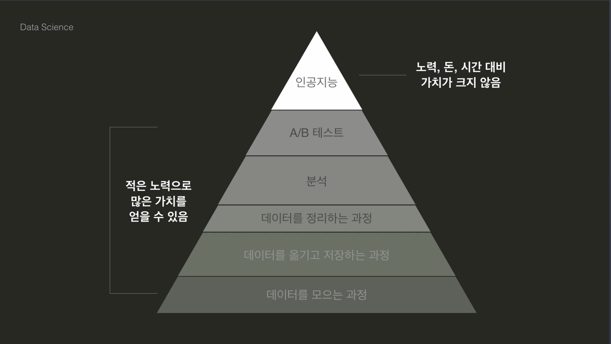

# 데이터 사이언스 시작하기

## 목차

## 1. 데이터 사이언스란?

### 02. 데이터 사이언스란 무엇인가요?

위키피디아에 따르면 데이터 사이언스란 _데이터 마이닝과 유사하게 정형, 비정형 형태를 포함한 다양한 데이터를 포함한 다양한 데이터로부터 지식과 인사이트를 추출하는데 과학적 방법론, 프로세스, 알고리즘, 시스템을 동원하는 융합분야다._

쉽게 데이터 사이언스란 다양한 데이터로부터 지식과 인사이트를 추출하는 분야라 생각해도 좋다.

이때 앞서 설명한 정형 데이터와 비정형 데이터는 쉽게 SQL과 NoSQL을 떠올리면 된다. 정형 데이터는 엑셀 파일처럼 정해진 구조에 축적되는 데이터를 의미하며 비정형 데이터는 반대로 소셜 네트워크 서비스 등에 개재한 게시글처럼 정해진 형식 없이 축적되는 데이터를 의미한다. 정형 데이터를 다루기 위해 등장한 데이터베이스 관리 시스템(DBMS_Database Management System)이 바로 SQL 계열이고 주로 비정형 데이터를 다루기 위해 등장한 데이터베이스 관리 시스템이 NoSQL 계열이다.

### 03. 데이터 사이언스에 대한 오해



데이터 사이언스에는 위 이미지와 같이 순서가 있다.

인공지능 자체가 중요한 순간도 있지만 이전에 데이터를 모으는 것부터 이를 저장하고 처리 및 분석하는 등 더 중요한 순서가 있다.

### 04. 왜 파이썬으로 데이터 사이언스?

R은 통계를 위해 만들어진 언어로 데이터 분석의 도구로 통계와 시각화에 특화되어 있다.

파이썬(Python)은 다양한 용도를 위해 만들어진 언어이다. 따라서 데이터 분야를 다른 분야에 접목시키기 쉽다.

### 05. 데이터 사이언스 프로세스

대략적인 프로세스는 아래와 같다.

1. 문제 정의하기
2. 데이터 모으기
3. 데이터 다듬기
4. 데이터 분석하기
5. 데이터 시각화 및 커뮤니케이션

#### 문제 정의하기

해결하고자 하는 문제를 정의하는 단계이다.

주로 아래와 같은 것들을 논의한다.

- 목표
- 기간
- 평가 방법
- 필요한 데이터

#### 데이터 모으기

필요한 데이터를 모을 수 있는 방법을 찾는 단계이다.

주로 아래와 같은 행위가 이뤄진다.

- 웹 크롤링
- 자료 모으기
- 파일 읽고 쓰기

#### 데이터 다듬기

데이터의 퀄리트를 높여 의미 있는 분석이 가능하게 만드는 단계이다. _쓰레기를 넣으면 쓰레기가 나온다(Garbage In, Garbage Out)_ 이란 말이 있을 정도로 수집한 데이터를 정제하는 작업은 무척 중요하다.

주로 아래와 같은 행위가 이뤄진다.

- 데이터 관찰하기
- 데이터 오류 제거
- 데이터 정리하기

#### 데이터 분석하기

수집과 정제가 끝난 데이터를 통해 정의된 문제에 따른 의미를 찾는 단계이다. 통계를 이용해 수치적으로 활용할 수도 있고 그래프를 그려 시각화할 수도 있다.

주로 아래와 같은 행위가 이뤄진다.

- 데이터 파악하기
- 데이터 변형하기
- 통계 분석
- 인사이트 발견
- 의미 도출

#### 데이터 시각화 및 커뮤니케이션

분석 결과를 다른 사람에게 전달하는 단계이다. 이때 적절한 시각화를 활용해 원활한 소통이 가능하다.

주로 아래와 같은 행위가 이뤄진다.

- 다양한 시각화
- 커뮤니케이션
- 리포트 작성

### 06. 선수 과제

> 테스트 케이스를 포함한 소스 코드는 [01.py](./01.py) 파일에서 확인 가능합니다.
>
> 투 포인터(Two Pointer)를 활용하여 시간 복잡도는 O(N), 공간 복잡도는 O(1)로 해결한 알고리즘입니다.

```Python
def is_palindrome(word: str) -> bool:
    start, end = 0, len(word)-1
    while start < end:
        if word[start] != word[end]:
            return False

        start, end = start+1, end-1

    return True
```

## 2. Jupyter Notebook

## 3. Numpy

## 4. Pandas
