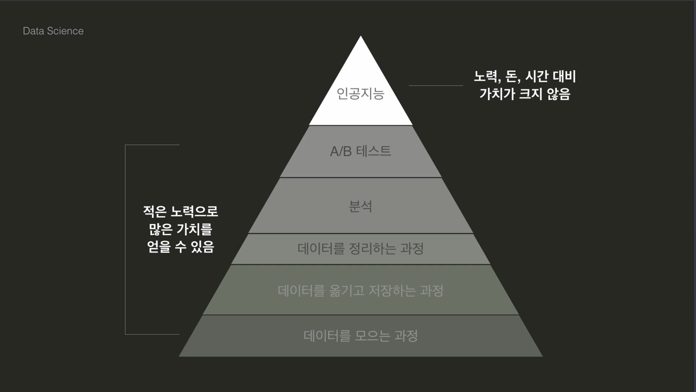

# 데이터 사이언스 시작하기

## 목차

- [1. 데이터 사이언스란?](#1-데이터-사이언스란)
  - [02. 데이터 사이언스란 무엇인가요?](#02-데이터-사이언스란-무엇인가요)
  - [03. 데이터 사이언스에 대한 오해](#03-데이터-사이언스에-대한-오해)
  - [04. 왜 파이썬으로 데이터 사이언스?](#04-왜-파이썬으로-데이터-사이언스)
  - [05. 데이터 사이언스 프로세스](#05-데이터-사이언스-프로세스)
  - [06. 선수 과제](#06-선수-과제)
- [2. Jupyter Notebook](#2-jupyter-notebook)
  - [01. 개발 환경 설정하기](#01-개발-환경-설정하기)
  - [06. Jupyter Notebook 둘러보기](#06-juypter-notebook-둘러보기)
  - [08. Cell 기본 동작 방식](#08-cell-기본-동작-방식)
  - [11. Jupyter Notebook에서 값 출력하기](#11-jupyter-notebook에서-값-출력하기)

## 1. 데이터 사이언스란?

### 02. 데이터 사이언스란 무엇인가요?

위키피디아에 따르면 데이터 사이언스란 _데이터 마이닝과 유사하게 정형, 비정형 형태를 포함한 다양한 데이터를 포함한 다양한 데이터로부터 지식과 인사이트를 추출하는데 과학적 방법론, 프로세스, 알고리즘, 시스템을 동원하는 융합분야다._

쉽게 데이터 사이언스란 다양한 데이터로부터 지식과 인사이트를 추출하는 분야라 생각해도 좋다.

이때 앞서 설명한 정형 데이터와 비정형 데이터는 쉽게 SQL과 NoSQL을 떠올리면 된다. 정형 데이터는 엑셀 파일처럼 정해진 구조에 축적되는 데이터를 의미하며 비정형 데이터는 반대로 소셜 네트워크 서비스 등에 개재한 게시글처럼 정해진 형식 없이 축적되는 데이터를 의미한다. 정형 데이터를 다루기 위해 등장한 데이터베이스 관리 시스템(DBMS_Database Management System)이 바로 SQL 계열이고 주로 비정형 데이터를 다루기 위해 등장한 데이터베이스 관리 시스템이 NoSQL 계열이다.

### 03. 데이터 사이언스에 대한 오해



데이터 사이언스에는 위 이미지와 같이 순서가 있다.

인공지능 자체가 중요한 순간도 있지만 이전에 데이터를 모으는 것부터 이를 저장하고 처리 및 분석하는 등 더 중요한 순서가 있다.

### 04. 왜 파이썬으로 데이터 사이언스?

R은 통계를 위해 만들어진 언어로 데이터 분석의 도구로 통계와 시각화에 특화되어 있다.

파이썬(Python)은 다양한 용도를 위해 만들어진 언어이다. 따라서 데이터 분야를 다른 분야에 접목시키기 쉽다.

### 05. 데이터 사이언스 프로세스

대략적인 프로세스는 아래와 같다.

1. 문제 정의하기
2. 데이터 모으기
3. 데이터 다듬기
4. 데이터 분석하기
5. 데이터 시각화 및 커뮤니케이션

#### 문제 정의하기

해결하고자 하는 문제를 정의하는 단계이다.

주로 아래와 같은 것들을 논의한다.

- 목표
- 기간
- 평가 방법
- 필요한 데이터

#### 데이터 모으기

필요한 데이터를 모을 수 있는 방법을 찾는 단계이다.

주로 아래와 같은 행위가 이뤄진다.

- 웹 크롤링
- 자료 모으기
- 파일 읽고 쓰기

#### 데이터 다듬기

데이터의 퀄리트를 높여 의미 있는 분석이 가능하게 만드는 단계이다. _쓰레기를 넣으면 쓰레기가 나온다(Garbage In, Garbage Out)_ 이란 말이 있을 정도로 수집한 데이터를 정제하는 작업은 무척 중요하다.

주로 아래와 같은 행위가 이뤄진다.

- 데이터 관찰하기
- 데이터 오류 제거
- 데이터 정리하기

#### 데이터 분석하기

수집과 정제가 끝난 데이터를 통해 정의된 문제에 따른 의미를 찾는 단계이다. 통계를 이용해 수치적으로 활용할 수도 있고 그래프를 그려 시각화할 수도 있다.

주로 아래와 같은 행위가 이뤄진다.

- 데이터 파악하기
- 데이터 변형하기
- 통계 분석
- 인사이트 발견
- 의미 도출

#### 데이터 시각화 및 커뮤니케이션

분석 결과를 다른 사람에게 전달하는 단계이다. 이때 적절한 시각화를 활용해 원활한 소통이 가능하다.

주로 아래와 같은 행위가 이뤄진다.

- 다양한 시각화
- 커뮤니케이션
- 리포트 작성

### 06. 선수 과제

> 테스트 케이스를 포함한 소스 코드는 [01.py](./01.py) 파일에서 확인 가능합니다.
>
> 투 포인터(Two Pointer)를 활용하여 시간 복잡도는 O(N), 공간 복잡도는 O(1)로 해결한 알고리즘입니다.

```Python
def is_palindrome(word: str) -> bool:
    start, end = 0, len(word)-1
    while start < end:
        if word[start] != word[end]:
            return False

        start, end = start+1, end-1

    return True
```

#### 개인적인 추가 내용

만약 순서를 바꿔서 판별해야 하는 경우 어떻게 해야 할까?

예를 들어 `ababc` 가 팰린드롬인지 확인하는 알고리즘을 만든다고 생각해보자. 앞서 풀이한 방식의 경우 주어진 문자열 자체의 순서를 바꿀 수 없는 경우였기 때문에 `ababc` 문자열은 팰린드롬이 아니지만 순서를 바꿀 수 있는 경우 `abcba` 혹은 `bacab` 등으로 문자열을 바꾸면 팰린드롬이 된다. 이를 해결하기 위해서는 팰린드롬의 규칙을 살펴볼 필요가 있다.

팰린드롬은 문자의 개수가 홀수개인 문자가 하나 혹은 0개일 때 유효하다. 예를 들어 문자열이 `abba` 인 경우 문자의 개수가 홀수개인 문자는 하나도 없으며 `abcba` 인 경우 문자의 개수가 홀수개인 문자는 `c` 하나이다. 만약 `abcdba` 와 같은 경우 문자의 개수가 홀수개인 문자는 `c` 와 `d` 로 두 개이며 해당 문자열은 팰린드롬이 아니다. 이 이유는 중앙값을 기준으로 좌우대칭이 되어야 유효한 팰린드롬이라 할 수 있는데 전체 문자의 개수가 홀수개인 경우 중앙값은 마치 기둥과 같은 역할이 되어 주어 해당 문자를 기준으로 좌우대칭이 되어야 하고 전체 문자의 개수가 짝수개인 경우 중앙값 자체가 없는 상태에서 좌우대칭이 되어야 하기 때문이다. 좌우대칭은 곧 좌측에 있는 문자열과 우측의 문자열이 같아야 한다는 의미이기 때문에 좌측과 우측에 있는 문자열은 무조건적으로 짝수일 수밖에 없다는 의미다.

따라서 등장하는 문자의 개수들을 판별하기 위해 해시맵, 파이썬에서는 딕셔너리를 사용하여 아래와 같이 이를 해결할 수 있다. 등장하는 문자들의 개수를 구한 다음 홀수개인 문자의 개수가 하나이거나 없을 때 유효한 팰린드롬으로 판별하면 된다. 해당 방식으로 문제를 풀 경우 시간 복잡도는 O(N)이고 공간 복잡도 또한 O(N)이다.

```Python
def is_onordered_palindrome(word: str) -> bool:
    table: dict[str, int] = {}
    for character in word:
        if character in table:
            table[character] += 1
        else:
            table[character] = 1

    odd_count: int = 0
    for count in table.values():
        if count % 2 == 1:
            odd_count += 1

    return True if odd_count <= 1 else False
```

이외에도 다른 방법이 하나 있다. 우리는 앞선 문제에서 입력값으로 주어지는 문자열이 전부 소문자 영어인 것을 알고 있다. 이러한 확실한 제약조건이 있을 때 사용할 수 있는 방법이 바로 비트 연산이다. XOR 연산을 활용하면 동일한 숫자에 대한 XOR 연산의 결괏값은 0이라는 것을 알 수 있다. 이는 다시 말해 문자을 아스키 코드로 변환했을 때 동일한 문자를 만나게 되면 XOR 연산에 의해 해당 문자가 없어진다는 것을 의미한다.

이러한 접근을 토대로 존재하는 모든 문자를 `set()` 함수를 사용해 집합 형태로 만든 다음 `0` 부터 시작한 값과 아스키 코드로 변환한 문자들에 XOR 연산을 수행한다. 만약 반복문이 수행된 뒤에 최종 결괏값이 `0` 인 경우 홀수개인 문자가 하나도 존재하지 않는다는 의미이고 만약 `0` 이 아닌 경우 홀수개인 문자가 존재한다는 의미인데 주어진 문자들의 집합에 해당 문자가 존재할 경우 하나만 존재한다는 의미이다.

```Python
def bit_manipulation(word: str) -> bool:
    answer: int = 0
    words: set = set(word)

    for character in word:
        answer ^= ord(character)

    if answer == 0 or chr(answer) in words:
        return True
    else:
        return False
```

## 2. Jupyter Notebook

### 01. 개발 환경 설정하기

파이썬으로 프로그래밍을 하는 방법으로는 크게 세 가지가 있다.

#### 텍스트 에디터 및 커맨드 라인 활용

텍스트 에디터에 코드를 쓰고 파일을 저장하면 운영 체제에 내장되어 있는 커맨드 라인으로 프로그램을 실행시킨다.

텍스트 에디터의 대표적인 예로 서브라임 텍스트(Sublime Text)나 아톰(Atom) 등이 있다. 이 방법의 가장 큰 장점은 가볍기 때문에 컴퓨터 사양이 좋지 않아도 잘 사용할 수 있다는 것이다. 그러나 제공해주는 기능이 그렇게 많지 않기 때문에 개발자가 실수를 많이 할 수도 있고 권장되지 않는 스타일로 코딩을 할 수도 있고 더 심각하게는 프로그램의 오류를 수정하는 과정이 어려울 수 있다.

#### IDE(Integrated Development Environment)

통합 개발 환경이라고도 하는 IDE의 대표적인 예로는 파이참(Pycharm) 등이 있다.

요즘에는 클라우드 IDE라고 해서 웹 브라우저로 사용하는 IDE도 존재한다. 텍스트 에디터와 달리 통합 개발 환경이기 때문에 제공하는 기능이 많다는 장점이 있다. 따라서 텍스트 에디터로는 한계가 있던 코딩 스타일을 적용 시키거나 디버깅을 편하게 하는 등의 여러 기능을 활용할 수 있다. 그러나 그만큼 소프트웨어 자체가 꽤 무겁다는 단점이 있다.

#### 주피터 노트북(Jupyter Notebook)

웹 브라우저에서 인터랙티브하게 작업을 하기 위한 도구이다.

보통 데이터 사이언스를 할 때 많이 사용된다. 줄 별로 인터랙티브하기 때문에 결과를 즉각적으로 확인 가능하고 코드를 여러 단계로 나눠서 결과물을 볼 수도 있다. 또한 마크다운 문법을 활용해서 설명글을 작성할 수도 있다. 그러나 통합 개발 환경에서 제공하는 여러 기능들이 없기 때문에 작업에 어려움이 존재하고 버전 관리나 협업 또한 어려움이 많다.

### 06. Juypter Notebook 둘러보기

주피터 노트북에서는 박스를 개별적인 셀(Cell)이라 부른다. 또한 커널 인디케이터(Kernel Indicator)라는게 존재하는데 커널(Kernel)은 작성한 코드를 실행시켜주는 엔진이며 커널 인디케이터는 이런 커널의 상태를 표시해주는 역할을 한다. 파이썬 언어를 활용해서 주피터 노트북을 사용할 경우 파이썬 커널을 사용하는 것이다.

### 08. Cell 기본 동작 방식

노트북에 있는 모든 셀들은 동일한 세션(Session)을 공유한다. 이때 셀의 실행 순서가 중요하다.

### 11. Jupyter Notebook에서 값 출력하기

`print()` 함수를 사용할 경우 셀 내의 모든 `print()` 함수가 수행되는 반면 단순히 값만 입력할 경우 셀의 가장 마지막 값만 출력된다.
